<div align="center">

# 🐾 AniyaPet — منصة متكاملة للتجارة الإلكترونية للحيوانات الأليفة

**تطبيق شامل مبني بـ Flutter لبيع وتوصيل مستلزمات وأنواع الحيوانات الأليفة، متكوّن من 3 تطبيقات منفصلة تعمل على نفس النظام البيئي (Ecosystem)**

[](https://flutter.dev)
[](https://dart.dev)
[](https://pub.dev/packages/get)
[](#)
[](https://flask.palletsprojects.com/)
[](#-الرخصة--license)

</div>

---

## 📖 نظرة عامة

**AniyaPet** هو متجر إلكتروني متكامل مخصص لبيع الحيوانات الأليفة ومستلزماتها، مبني بالكامل باستخدام **Flutter** ويتكوّن من **3 تطبيقات منفصلة** تتشارك نفس الـ Backend:

| # | التطبيق | الوصف |
|---|---------|--------|
| 1️⃣ | **User App** | تطبيق العميل — تصفح، شراء، تتبع الطلبات، ودردشة مع الـ Chatbot |
| 2️⃣ | **Delivery App** | تطبيق المندوب — استلام الطلبات، التنقل عبر الخرائط، وتحديث حالة التوصيل |
| 3️⃣ | **Admin App** | لوحة تحكم الأدمن — إدارة المستخدمين، الأصناف، المنتجات، والطلبات |

المشروع مدعوم بميزة **ذكاء اصطناعي** لتصنيف الحيوانات، و**Chatbot** ذكي للرد على استفسارات العملاء، بالإضافة إلى نظام **Recommendation** يعتمد على المنتجات الأكثر مبيعًا.

---

## 📑 جدول المحتويات

- [لقطات من التطبيق](#-لقطات-من-التطبيق--screenshots)
- [المميزات الرئيسية](#-المميزات-الرئيسية)
  - [تطبيق اليوزر](#-1-تطبيق-اليوزر-user-app)
  - [تطبيق المندوب](#-2-تطبيق-المندوب-delivery-app)
  - [تطبيق الأدمن](#-3-تطبيق-الأدمن-admin-app)
- [التقنيات المستخدمة](#-التقنيات-المستخدمة--tech-stack)
- [البنية المعمارية](#-البنية-المعمارية--architecture)
- [هيكل المشروع](#-هيكل-المشروع--project-structure)
- [ميزة الذكاء الاصطناعي](#-ميزة-الذكاء-الاصطناعي)
- [طريقة التشغيل](#-طريقة-التشغيل--getting-started)
- [متغيرات البيئة](#-متغيرات-البيئة--environment-variables)
- [خارطة الطريق](#-خارطة-الطريق--roadmap)
- [المساهمة](#-المساهمة--contributing)
- [الرخصة](#-الرخصة--license)
- [التواصل](#-التواصل--contact)

---

## 📸 لقطات من التطبيق / Screenshots

### 🧑‍💻 User App

<table>
<tr>
<td align="center">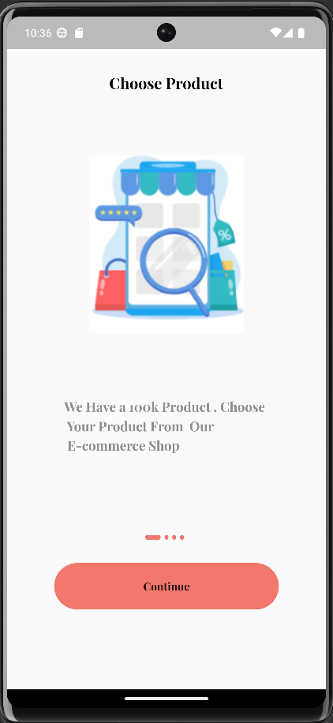<br><sub>Onboarding</sub></td>
<td align="center">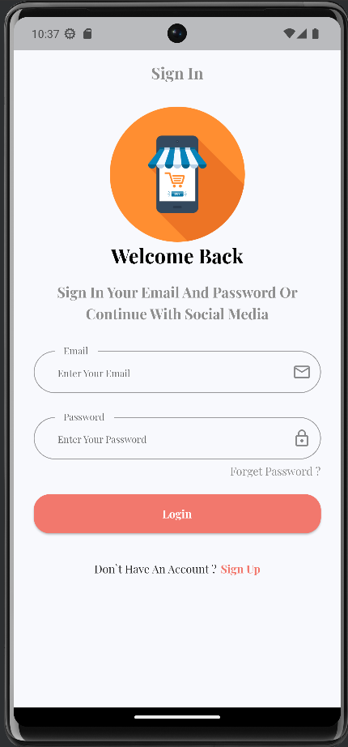<br><sub>Sign In</sub></td>
<td align="center">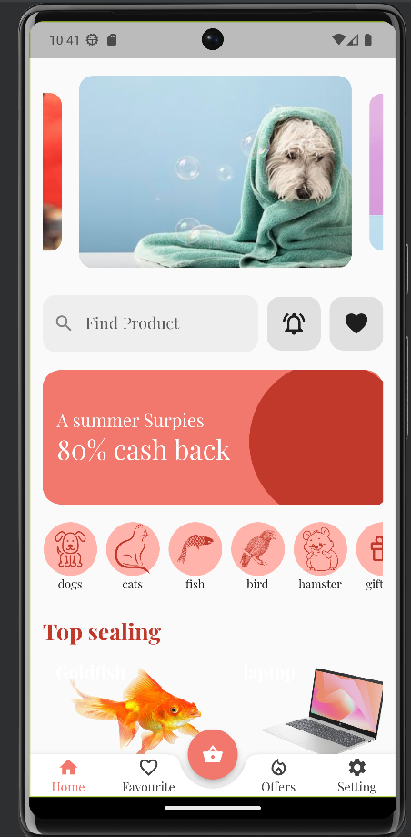<br><sub>Home</sub></td>
<td align="center">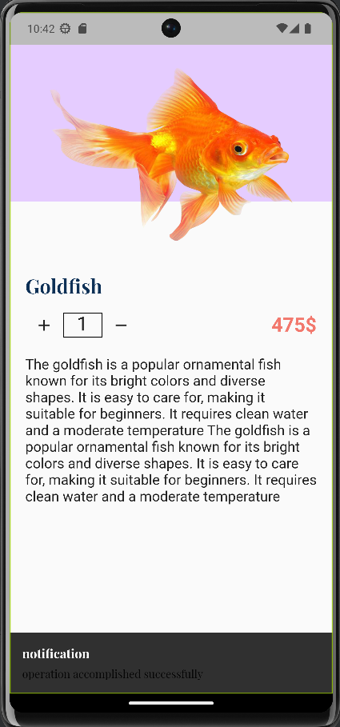<br><sub>Product Details</sub></td>
</tr>
<tr>
<td align="center">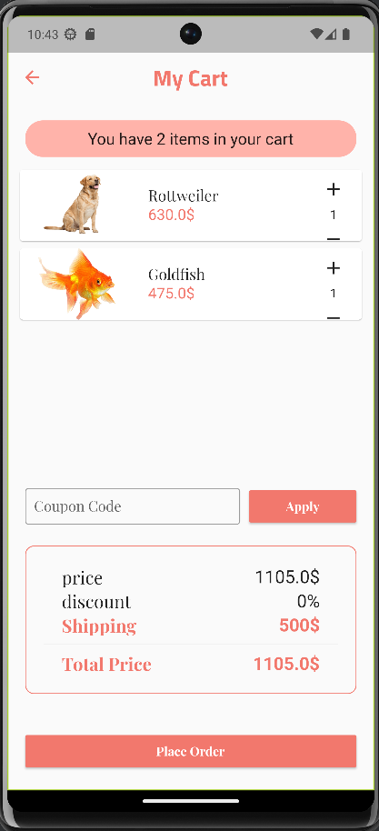<br><sub>My Cart</sub></td>
<td align="center">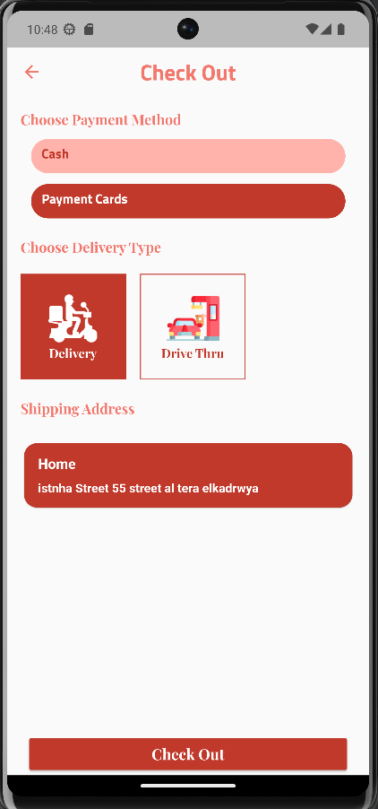<br><sub>Check Out</sub></td>
<td align="center">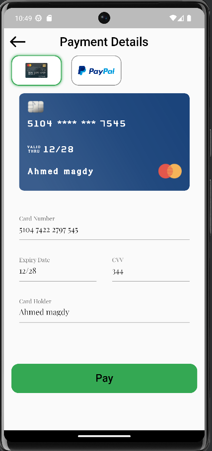<br><sub>Payment</sub></td>
<td align="center">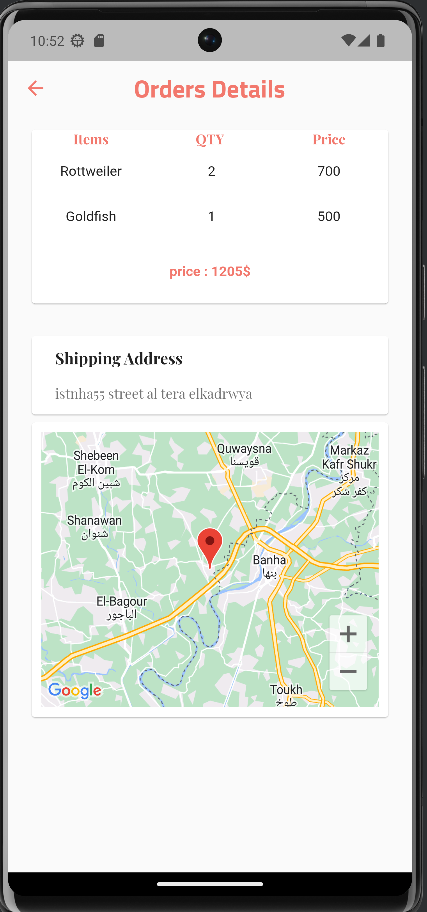<br><sub>Order + Google Maps</sub></td>
</tr>
<tr>
<td align="center">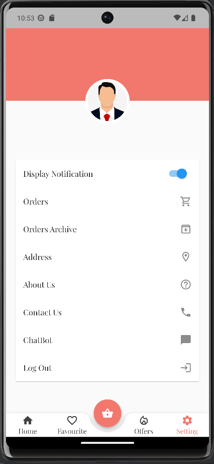<br><sub>Profile / Settings</sub></td>
</tr>
</table>

### 🛠️ Admin App

<table>
<tr>
<td align="center">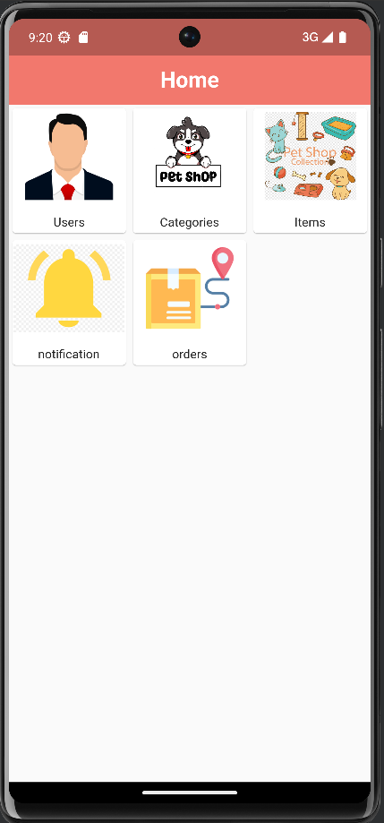<br><sub>Dashboard</sub></td>
<td align="center">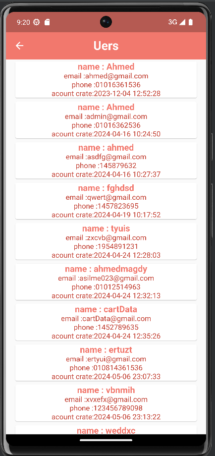<br><sub>Users</sub></td>
<td align="center">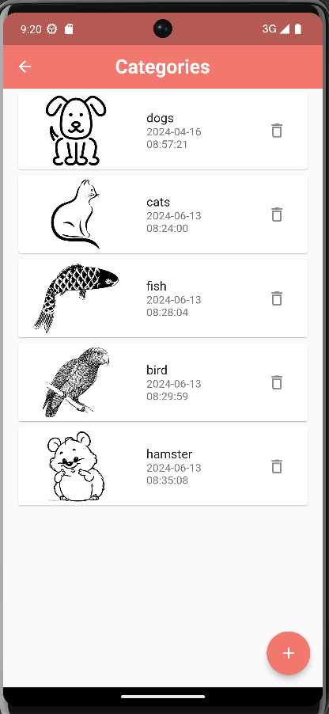<br><sub>Categories</sub></td>
<td align="center">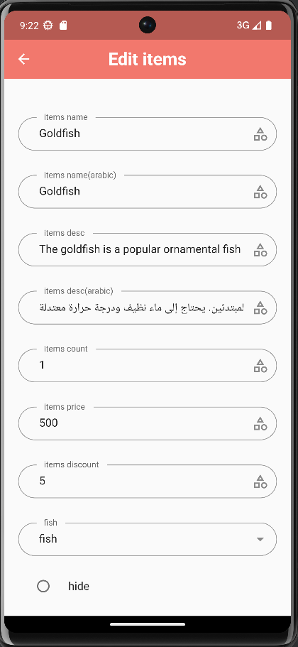<br><sub>Edit Item (AR/EN)</sub></td>
</tr>
<tr>
<td align="center">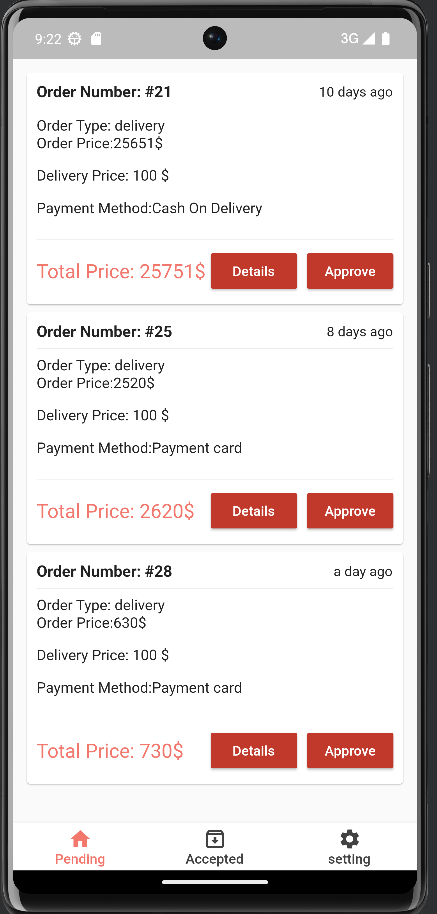<br><sub>Orders Management</sub></td>
<td align="center">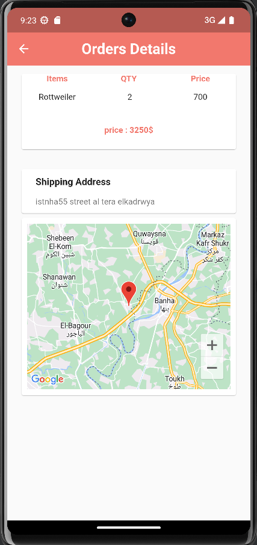<br><sub>Order Details + Map</sub></td>
</tr>
</table>

> باقي اللقطات موجودة كاملة داخل مجلد `assets/`.

---

## ✨ المميزات الرئيسية

### 📱 1) تطبيق اليوزر (User App)

- **🔐 نظام Authentication كامل**
  - تسجيل دخول / إنشاء حساب بالإيميل والباسورد
  - Sign in / Sign up مع دعم الدخول عبر السوشيال ميديا
  - نسيت كلمة المرور (Forget Password) + إرسال كود تحقق (OTP) عبر الإيميل
  - شاشة تأكيد النجاح بعد التسجيل

- **🌍 دعم لغتين (Localization)**
  - العربية والإنجليزية بشكل كامل (Content + UI)
  - اختيار اللغة من أول شاشة Onboarding

- **🏠 الصفحة الرئيسية (Home)**
  - بانرات عروض وخصومات (Offers Banner)
  - أقسام الحيوانات: `Dogs`, `Cats`, `Fish`, `Bird`, `Hamster`, `Gifts`
  - قسم **"Top Selling"** — نظام Recommendation يعرض المنتجات الأكثر مبيعًا
  - بحث فوري عن المنتجات (Search)

- **🐕 عرض المنتجات**
  - فلترة المنتجات حسب القسم (Category)
  - صفحة تفاصيل منتج (وصف، تقييم، سعر، عداد كمية +/-)
  - إضافة/إزالة من المفضلة (Favourites) بضغطة قلب واحدة

- **🛒 السلة والطلبات**
  - إدارة الكمية لكل منتج داخل الكارت
  - تفعيل كوبونات الخصم (Coupon Code)
  - حساب تلقائي للسعر الفرعي + الشحن + الإجمالي

- **💳 الدفع (Checkout & Payment)**
  - اختيار طريقة الدفع: **Cash** أو **Payment Cards**
  - اختيار نوع الاستلام: **Delivery** أو **Drive Thru**
  - إدارة عنوان الشحن (Shipping Address)
  - شاشة دفع بالكارت (Card / PayPal) مع بطاقة تفاعلية تعرض بيانات الكارت

- **📦 تتبع الطلبات**
  - **Pending Orders**: الطلبات الجارية مع تفاصيلها كاملة
  - **Orders Archive**: أرشيف الطلبات المكتملة
  - عرض تفاصيل كل طلب (الأصناف، الكمية، السعر) + **خريطة Google Maps** لموقع التوصيل
  - تقييم الطلب بعد التسليم (Rating Dialog بالنجوم + تعليق)

- **🔔 نظام إشعارات**
  - إشعارات فورية بحالة الطلب (تأكيد، في الطريق، تسليم، إلخ)
  - تفعيل/تعطيل الإشعارات من الإعدادات

- **🤖 ميزات الذكاء الاصطناعي**
  - **تصنيف الحيوانات بالصور (AI Image Classification)**
  - **PetBot Chatbot** — شات بوت ذكي يجاوب على استفسارات العملاء

- **👤 الملف الشخصي والإعدادات**
  - إدارة العناوين، عرض الطلبات وأرشيفها
  - About Us / Contact Us
  - تسجيل الخروج

---

### 🚴 2) تطبيق المندوب (Delivery App)

> ملحوظة: صور هذا التطبيق لم تُرفق ضمن الملف، والوصف التالي مبني على تدفق الحالات الظاهر في تطبيقَي اليوزر والأدمن (`Pending → Accepted → On the way → Delivered`).

- تسجيل دخول مخصص لحساب مندوب التوصيل
- استلام إشعار فوري بالطلبات الجديدة المخصصة له
- عرض تفاصيل الطلب (المنتجات، الكمية، السعر، طريقة الدفع)
- تحديد موقع العميل والتنقل إليه عبر **Google Maps**
- تحديث حالة الطلب لحظيًا (قيد التوصيل → تم التسليم)
- سجل الطلبات المكتملة (Delivery History)
- إشعار العميل تلقائيًا عند كل تغيير في حالة الطلب

---

### 🖥️ 3) تطبيق الأدمن (Admin App)

- **🔐 تسجيل دخول مخصص للأدمن**

- **👥 إدارة المستخدمين (Users)**
  - عرض قائمة كاملة بكل المستخدمين المسجلين (الاسم، الإيميل، رقم الهاتف، تاريخ التسجيل)

- **🗂️ إدارة الأقسام (Categories)**
  - عرض/إضافة/تعديل/حذف الأقسام
  - **دعم إدخال ثنائي اللغة** (اسم القسم بالعربي والإنجليزي) مع صورة مخصصة لكل قسم

- **📦 إدارة المنتجات (Items)**
  - إضافة/تعديل/حذف المنتجات
  - حقول كاملة: الاسم (AR/EN)، الوصف (AR/EN)، الكمية، السعر، نسبة الخصم، القسم، صورة المنتج
  - خيار **إخفاء المنتج (Hide)** بدون حذفه نهائيًا

- **📬 إدارة الإشعارات**
  - إرسال إشعارات للمستخدمين مباشرة من لوحة التحكم

- **🧾 إدارة الطلبات (Orders)**
  - تبويب **Pending** لاعتماد الطلبات الجديدة (Approve)
  - تبويب **Accepted** لمتابعة الطلبات المعتمدة
  - عرض تفاصيل كل طلب (الأصناف، الكمية، السعر) + **خريطة Google Maps** لعنوان الشحن

---

## 🧰 التقنيات المستخدمة / Tech Stack

| الفئة | التقنية |
|---|---|
| **Frontend (3 تطبيقات)** | Flutter (Dart) |
| **State Management** | [GetX](https://pub.dev/packages/get) |
| **Backend** | REST API خاص (Node.js / Laravel — حسب إعداد السيرفر) |
| **الذكاء الاصطناعي (تصنيف الحيوانات + Chatbot)** | Backend مخصص بلغة **Python** باستخدام **Flask** |
| **الخرائط والموقع** | Google Maps API |
| **الإشعارات** | Push Notifications |
| **التخزين المحلي** | GetStorage / SharedPreferences |
| **تعدد اللغات** | Flutter Localization (AR / EN) |

---

## 🏗️ البنية المعمارية / Architecture

المشروع مقسّم إلى 3 تطبيقات Flutter مستقلة تتشارك نفس الـ **REST API Backend**، بحيث:

```
                         ┌───────────────────────┐
                         │     REST API Backend   │
                         │   (Node.js / Laravel)   │
                         └──────────┬─────────────┘
                                    │
              ┌─────────────────────┼─────────────────────┐
              │                     │                     │
     ┌────────▼────────┐  ┌─────────▼─────────┐  ┌─────────▼─────────┐
     │    User App      │  │  Delivery App      │  │    Admin App      │
     │   (Flutter/GetX)  │  │  (Flutter/GetX)     │  │  (Flutter/GetX)    │
     └────────────────────┘  └─────────────────────┘  └─────────────────────┘
                                    │
                         ┌──────────▼─────────────┐
                         │  AI Service (Python)    │
                         │  Flask API              │
                         │  • Animal Classification │
                         │  • PetBot Chatbot         │
                         └───────────────────────────┘
```

كل تطبيق يتبع نمط **GetX Pattern** (Controller – View – Binding – Routes)، مع فصل واضح بين:
- `Views` — واجهات المستخدم
- `Controllers` — منطق العمل وربط البيانات (Reactive State)
- `Services` — التعامل مع الـ REST API
- `Models` — نماذج البيانات (Users, Items, Categories, Orders...)
- `Bindings` — حقن الاعتمادية (Dependency Injection)

---

## 📁 هيكل المشروع / Project Structure

```
aniyapet/
│
├── user_app/                  # تطبيق العميل
│   ├── lib/
│   │   ├── controllers/
│   │   ├── views/
│   │   │   ├── auth/
│   │   │   ├── home/
│   │   │   ├── cart/
│   │   │   ├── checkout/
│   │   │   ├── orders/
│   │   │   ├── chatbot/
│   │   │   └── settings/
│   │   ├── models/
│   │   ├── services/
│   │   ├── bindings/
│   │   ├── routes/
│   │   └── main.dart
│   └── assets/
│
├── delivery_app/               # تطبيق المندوب
│   ├── lib/
│   │   ├── controllers/
│   │   ├── views/
│   │   ├── models/
│   │   └── main.dart
│   └── assets/
│
├── admin_app/                  # لوحة تحكم الأدمن
│   ├── lib/
│   │   ├── controllers/
│   │   ├── views/
│   │   │   ├── users/
│   │   │   ├── categories/
│   │   │   ├── items/
│   │   │   └── orders/
│   │   ├── models/
│   │   └── main.dart
│   └── assets/
│
├── backend/                    # REST API (Node.js / Laravel)
│   ├── controllers/
│   ├── models/
│   ├── routes/
│   └── ...
│
├── ai_service/                 # خدمة الذكاء الاصطناعي (Python/Flask)
│   ├── app.py
│   ├── models/                 # نموذج تصنيف الحيوانات
│   ├── chatbot/                # منطق PetBot
│   └── requirements.txt
│
├── assets/                     # لقطات الشاشة المستخدمة في هذا الملف
│   ├── user/
│   └── admin/
│
└── README.md
```

---

## 🤖 ميزة الذكاء الاصطناعي

المشروع يحتوي على **Backend مخصص بلغة Python (Flask)** يقدّم خدمتين رئيسيتين عبر API خاص به:

1. **تصنيف الحيوانات (Animal Classification)**
   - يستقبل صورة من التطبيق ويُرجع نوع/فصيلة الحيوان المتوقع
   - يُستخدم لتسهيل عملية البحث والتصنيف داخل المتجر

2. **PetBot — Chatbot ذكي**
   - يستقبل استفسارات العميل بشكل نصي
   - يرد بمعلومات عن المنتجات، حالة الطلبات، أو استفسارات عامة عن رعاية الحيوانات

> تواصل تطبيقات Flutter مع هذه الخدمة عبر طلبات HTTP مستقلة عن الـ Backend الرئيسي، مما يسمح بتحديث/تدريب النموذج دون التأثير على باقي النظام.

---

## 🚀 طريقة التشغيل / Getting Started

### المتطلبات الأساسية

- [Flutter SDK](https://docs.flutter.dev/get-started/install) (3.x أو أحدث)
- [Dart SDK](https://dart.dev/get-dart)
- Android Studio / VS Code
- حساب [Google Cloud Platform](https://console.cloud.google.com/) مفعّل عليه **Maps SDK**
- Node.js أو PHP (حسب تقنية الـ Backend) لتشغيل السيرفر
- Python 3.9+ لتشغيل خدمة الذكاء الاصطناعي

### خطوات التشغيل

```bash
# 1. استنساخ المشروع
git clone https://github.com/A7medMg/ecommerce33.git
cd aniyapet

# 2. تشغيل تطبيق اليوزر
cd ../user_app
flutter pub get
flutter run

# 3. تشغيل تطبيق المندوب
cd ../delivery_app
flutter pub get
flutter run

# 4. تشغيل تطبيق الأدمن
cd ../admin_app
flutter pub get
flutter run
```

---

## 🔑 متغيرات البيئة / Environment Variables

أنشئ ملف `.env` في كل تطبيق (أو `dart-define` عند البناء) يحتوي على:

```env
BASE_API_URL=https://your-api-domain.com/api
GOOGLE_MAPS_API_KEY=YOUR_GOOGLE_MAPS_KEY
AI_SERVICE_URL=https://your-ai-service.com
```

---

## 🗺️ خارطة الطريق / Roadmap

- [ ] دعم بوابات دفع إضافية (Fawry, Vodafone Cash)
- [ ] نظام إشعارات Push حقيقي بديل عن Local Notifications
- [ ] لوحة تحليلات (Analytics Dashboard) للأدمن
- [ ] تتبع مباشر (Live Tracking) لموقع المندوب على خريطة العميل
- [ ] تحسين دقة نموذج تصنيف الحيوانات
- [ ] دعم لغات إضافية

---

## 🤝 المساهمة / Contributing

المساهمات مرحّب بها! لو حابب تساهم في المشروع:

1. اعمل Fork للمشروع
2. أنشئ Branch جديد (`git checkout -b feature/AmazingFeature`)
3. Commit للتغييرات (`git commit -m 'Add some AmazingFeature'`)
4. Push للـ Branch (`git push origin feature/AmazingFeature`)
5. افتح Pull Request


## 📬 التواصل / Contact

لأي استفسار أو اقتراح، تواصل عبر:

- **Email:** ahmedmagdy8064@gmail.com


---

<div align="center">

**Made with ❤️ using Flutter**

</div>
